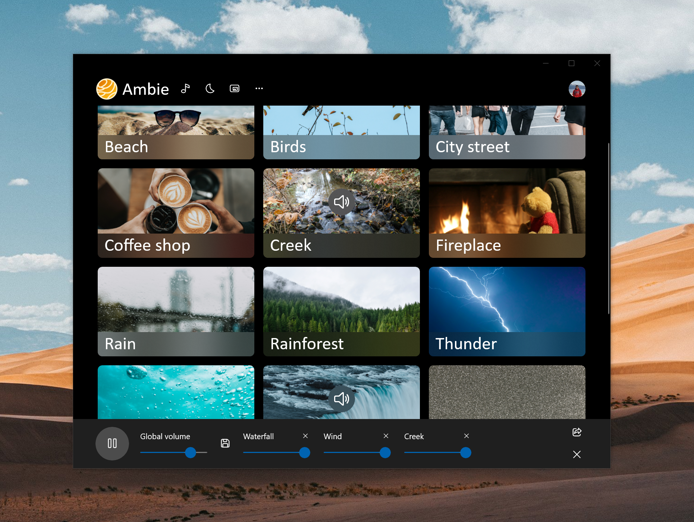

# Ambie

A modern Windows app that plays soothing tones to help you be healthier, happier, and more relaxed.

Download from store: https://www.microsoft.com/store/productId/9P07XNM5CHP0

Chat about Ambie on Discord: https://discord.gg/b9z3BeXk3D

## Motivation

The motivation behind Ambie is to build a simple but beautiful soothing sounds player for Windows. Animations are used to enhance the experience. Only a few UI elements are available in the app. This is on purpose because for Ambie, _less is more_.

## Translation

Ambie needs volunteer translators! To help translate, follow these instructions.

### Adding a new language (requires Visual Studio 2019 and Multilingual App Toolkit)
- Ensure you have Visual Studio 2019 and the [Multilingual App Toolkit extension](https://marketplace.visualstudio.com/items?itemName=MultilingualAppToolkit.MultilingualAppToolkit-18308).
- Fork and clone this repo.
- Open in VS 2019.
- Right click on the `AmbientSounds.Uwp` project.
- Select Multilingual App Toolkit > Add translation language.
    - If you get a message saying "Translation Provider Manager Issue," just click Ok and ignore it. It's unrelated to adding a language.
- Select a language. 
- Once you select a language, new `.xlf` files will be created in the `MultilingualResources` folder.
- Now follow the `Improving an existing language` steps below.

### Improving an existing language (can be done with any text editor)
- Inside the `MultilingualResources` folder, open the `.xlf` of the language you want to translate.
    - You can open using any text editor, or you can use the [Multilingual Editor](https://developer.microsoft.com/windows/develop/multilingual-app-toolkit)
- If you're using a text editor, translate the strings inside the `<target>` node. Then change the `state` property to `translated`.
    
- If you're using the Multilingual Editor, translate the strings inside the `Translation` text field. Make sure to save to preserve your changes.
    
- Once you're done, commit your changes, push to GitHub, and make a pull request.

## Contributors

Pull requests are welcome! Please keep in mind the motivation behind Ambie, however: _Less is more_. New sound requests are appreciated. New sounds must
- Have a license that can work with Ambie
- Have an image
- Have attributions for sound and image

For all pull requests, please make sure there's an issue created for it first and that maintainers have confirmed that the issue or feature request can be addressed. Maintainers can then assign the issue to you so that others can track who's working on what issue. In some cases, you might have contacted the maintainers directly via other channels such as Twitter or Discord. You might have asked the maintainers if you can submit a PR. In those scenarios, an issue is not required.

## Attributions
- [Windows Community Toolkit](https://github.com/windows-toolkit/WindowsCommunityToolkit)
- [WinUI library](https://github.com/Microsoft/microsoft-ui-xaml)
- [Sounds](https://freesound.org). Specific file attributions are in `Data.json`.
- [Images](https://unsplash.com/). Specific image attributions are in `Data.json`.
- [Microsoft.Extensions.DependencyInjection](https://www.nuget.org/packages/Microsoft.Extensions.DependencyInjection/)
- [System.Text.Json](https://www.nuget.org/packages/System.Text.Json/)
- [AppCenter Analytics](https://appcenter.ms/)

## Thank you translators!

- Korean: Jasmine
- Czech: [Michal Moudrý](https://github.com/MichalMoudry)
- Spanish: [Leonardo González Castro](https://github.com/OnlyOnePro), [Breece W](https://github.com/BreeceW)
- Hungarian: [Kristóf Kékesi](https://github.com/KristofKekesi)
- Portuguese [BR]: [Vinicius Rodrigues](https://github.com/Suburbanno)
- Turkish: [Serdar Türkoğlu](https://github.com/daswareinfach)
- Danish: [Paw Hauge Byrialsen](https://github.com/byrialsen)
- Dutch: [Christof Becu](https://github.com/ChristofBecu)
