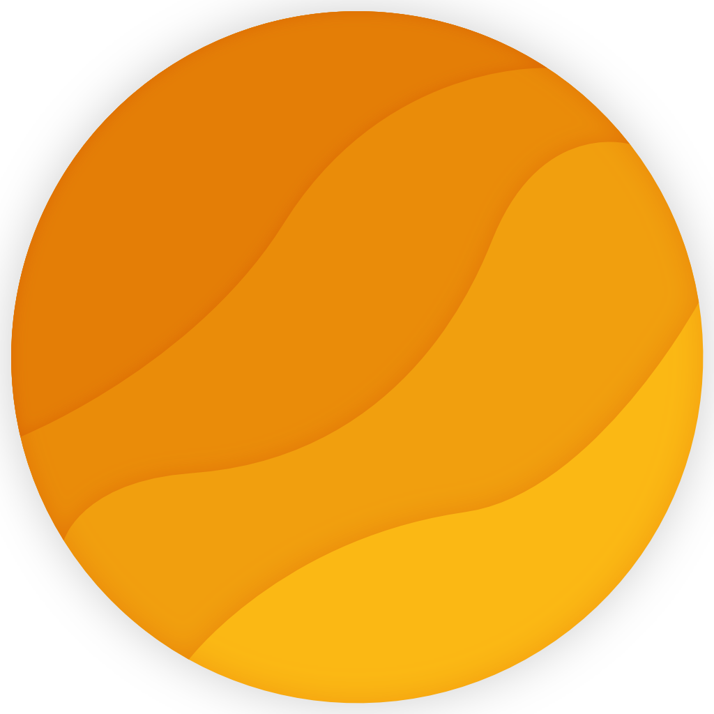
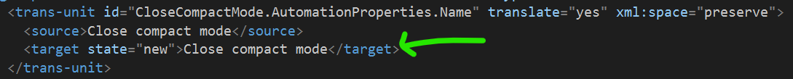
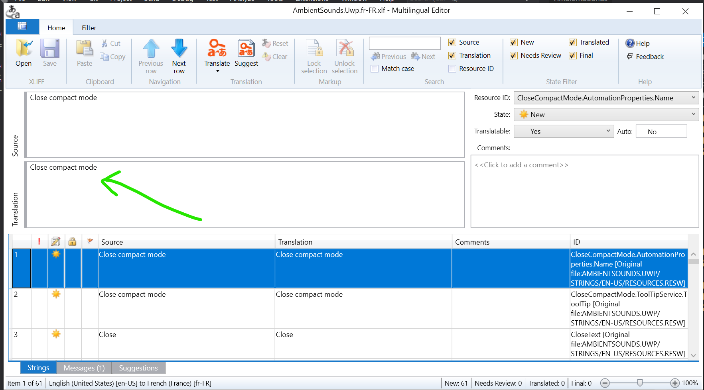

  

<h1 align="center">
  Ambie
</h1>

  Focus, study, or relax. Sounds for every mood.

  

## Introduction

Ambie is an app that plays white noise and nature sounds to help you focus, sleep, and unwind. For many people, having background noise while working on a task helps with concentration. Ambie has a good starting selection of built-in sounds such as rain and beach waves that help you. These can also be used to help you sleep, relax, and de-stress. For instance, those with tinnitus and anxiety have reached out saying Ambie has helped them. And if you download Ambie from the Microsoft Store, you'll get access to a catalogue of online sounds that you can download to expand your library.

## Product pillars

When building features, these product pillars must be used to decide which ones are prioritized higher or lower. 
1. Ambie primarily helps people focus or relax using white noise and nature sounds. All other features are secondary and must support the primary mission. Secondary features may be cut if they take away from the primary mission.
1. Ambie focuses on minimalism and UX performance. Features being built must maintain or improve UX performance and must have a minimalist and intuitive UX.
1. Ambie will have all local features free, but downloadable content should be prioritized for Ambie+. Features that remove or reduce incentive for Ambie+ should be deprioritized. 

## From the Press

One of [FastCompany's best new apps for productivity](https://www.fastcompany.com/90766562/the-23-best-new-productivity-apps-for-2022) in 2022 (USA):
> Great ambient noise apps are in short supply on Windows PCs, which is why Ambie is so refreshing. It includes dozens of high-quality background sounds, plus the ability to save your own custom mixes. A major update this year added focus timers and a simple notepad, making this a one-stop concentration shop.

One of [Xataka's best Windows apps](https://www.xataka.com/basics/mejores-apps-2022-para-windows-nuevas-imprescindible-joyas-ocultas) in 2022 (Spain):
> It is a simple and colorful application, although with several utilities. On the one hand, you have a wide catalog of sounds to play the one you like the most, but it also allows you to mix sounds to create a unique one.

Included in [Beebom's list of best apps on Windows 11](https://beebom.com/best-windows-11-apps/) (India):
> The app works miracles when you are trying to focus on work or studies. It lets you set a timer and choose your favorite natural sound from its curated catalog. I love this well-designed app, and I strongly recommend instaling Ambie White Noise if you have a hard time focusing at work or school.

## Contribute

For new features, please make sure there's an issue created for it first and that maintainers have confirmed that the new feature should be on Ambie's roadmap. In some cases, you might have contacted the maintainers directly via other channels such as Twitter or Discord. You might have asked the maintainers if you can submit a PR. In those scenarios, an issue is not required.

For bug fixes and translations, please feel free to open a PR right away.

## Translation

To help translate, follow these instructions.

### Adding a new language (requires Visual Studio 2022 and Multilingual App Toolkit)
- Ensure you have Visual Studio 2022 and the [Multilingual App Toolkit extension](https://marketplace.visualstudio.com/items?itemName=dts-publisher.mat2022).
- Fork and clone this repo.
- Open in VS 2022.
- Right click on the `AmbientSounds.Uwp` project.
- Select Multilingual App Toolkit > Add translation language.
    - If you get a message saying "Translation Provider Manager Issue," just click Ok and ignore it. It's unrelated to adding a language.
- Select a language. 
- Once you select a language, new `.xlf` files will be created in the `MultilingualResources` folder.
- Find and install `Humanizer.Core` nuget package for a new language
- Now follow the `Improving an existing language` steps below.

### Improving an existing language (can be done with any text editor)
- Inside the `MultilingualResources` folder, open the `.xlf` of the language you want to translate.
    - You can open using any text editor, or you can use the [Multilingual Editor](https://developer.microsoft.com/windows/develop/multilingual-app-toolkit)
- If you're using a text editor, translate the strings inside the `<target>` node. Then change the `state` property to `translated`.
    
- If you're using the Multilingual Editor, translate the strings inside the `Translation` text field. Make sure to save to preserve your changes.
    
- Once you're done, commit your changes, push to GitHub, and make a pull request.

## Third-Party Software and Other Attributions
- [Windows Community Toolkit](https://github.com/windows-toolkit/WindowsCommunityToolkit)
- [WinUI library](https://github.com/Microsoft/microsoft-ui-xaml)
- [Sounds](https://freesound.org). Specific file attributions are in `Data.json`.
- [Images](https://unsplash.com/). Specific image attributions are in `Data.json`.
- [Microsoft.Extensions.DependencyInjection](https://www.nuget.org/packages/Microsoft.Extensions.DependencyInjection/)
- [System.Text.Json](https://www.nuget.org/packages/System.Text.Json/)
- [AppCenter Analytics](https://appcenter.ms/)

## Special Thanks

### Contributors

### Translators

- Czech: [Michal Moudrý](https://github.com/MichalMoudry)
- Spanish: [Leonardo González Castro](https://github.com/OnlyOnePro), [Breece W](https://github.com/BreeceW)
- Hungarian: [Kristóf Kékesi](https://github.com/KristofKekesi)
- Portuguese [BR]: [Vinicius Rodrigues](https://github.com/Suburbanno)
- Turkish: [Serdar Türkoğlu](https://github.com/daswareinfach)
- Danish: [Paw Hauge Byrialsen](https://github.com/byrialsen)
- Dutch: [Christof Becu](https://github.com/ChristofBecu)
- Russian: [Dmitry Gorbushin](https://github.com/Gorbushin)
- Hebrew: [Adam Dernis](https://github.com/Avid29)
- Polish: [Maciej Klupp](https://github.com/maciej-klupp)
- Ukrainian: [Andrii Yakonyuk](https://github.com/andrewyakonyuk)
- Persian [FA]: [Reza Roointan](https://github.com/rezaroointan)
