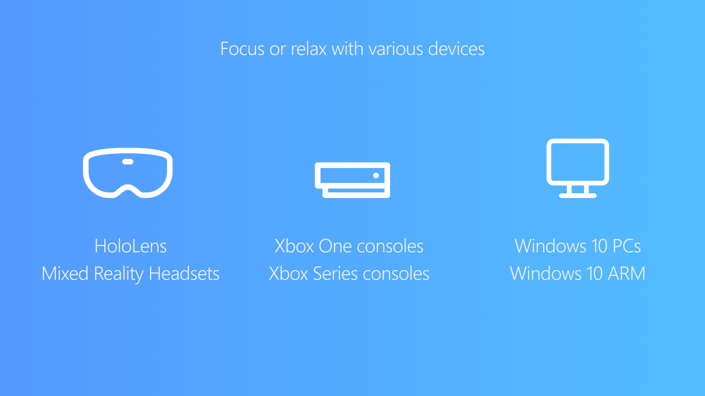

# Ambie White Noise

   

## Features

- List of pre-installed sounds such as beach, coffee shop, and rain
- Includes a growing catalogue of sounds to download
- Sleep timer to pause playback after a certain time
- Personalize your space with custom backgrounds
- Screensaver that is triggered after some time of no movement
- Use `Compact Mode` to display a mini Ambie window

## Home

## Personalize

## Catalogue

## Screensaver

## Compatibility

## Support or Contact

Having trouble with Ambie? Contact the creator at ambie_app@outlook.com or [submit a GitHub issue](https://github.com/jenius-apps/ambie/issues/new).
